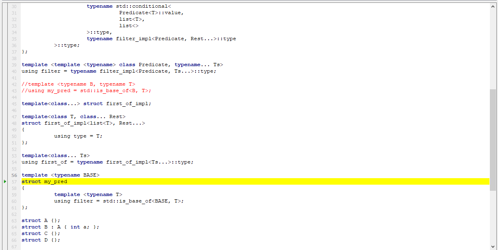

# MREdit

MREdit is a Qt5 text editor better suited for source code editors.

It is a fork of [qodeedit](https://github.com/pasnox/qodeedit), making it more flexible and removing the syntax highlight part.

Features:

* Configurable margin with line numbers, revision status, and bookmarks.
* Multiple bookmark kinds with full formatting, like margin image, font and background colors, etc. They can be easily used to make debuggers for example.
* Label-like widget to show syntax-highlighted text.

See the example in the example directory.

### Author

Rangel Reale (rangelspam@gmail.com)
